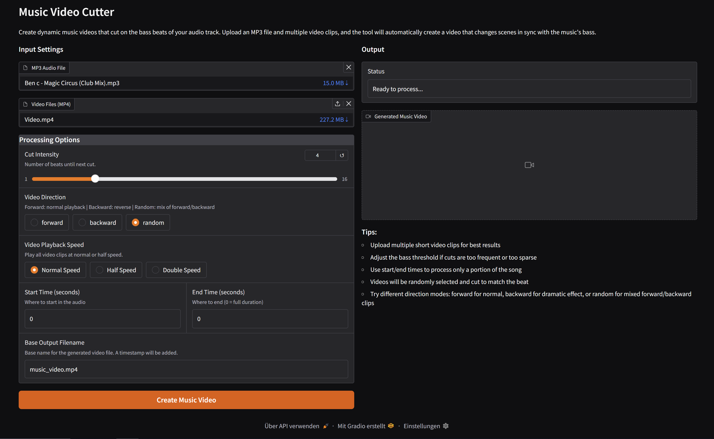

# Music Video Cutter

A tool to automatically create music videos where the cuts are synchronized to the music's beat. Upload an audio file and a collection of video clips, and the application will generate a dynamic, rhythmic video.



---

## Features

- **Automatic Beat Detection:** Analyzes the audio file to identify a regular, bass-focused beat, which serves as the foundation for the video cuts.
- **Video Clip Synchronization:** Randomly selects and clips segments from your provided videos, stitching them together in perfect sync with the detected beat grid.
- **Simple Web Interface:** Built with [Gradio](https://www.gradio.app/), the tool is easy to use directly from your web browser with no command-line knowledge required.
- **Rich Customization Options:**
  - **Cut Intensity:** Control how often a cut occurs (e.g., on every 2nd, 4th, or 8th beat).
  - **Playback Speed:** Play video clips at normal, half, or double speed to achieve different visual effects.
  - **Playback Direction:** Choose between forward, backward, or a random mix of playback directions for the clips.
  - **Select Audio Section:** Process only a specific portion of the audio file by setting a start and end time.
- **Automated File Management:** Finished videos are automatically saved to an `output` folder with a unique timestamp in the filename, preventing files from being overwritten.

---

## Installation

Follow these steps to run the project locally.

**Prerequisites:**

- Python 3.8 or higher
- [FFmpeg](https://ffmpeg.org/): Make sure FFmpeg is installed on your system and accessible in your system's PATH. MoviePy requires it to read and write video files.

**Installation Steps:**

1. **Clone the repository:**

    ```bash
    git clone https://github.com/YOUR_USERNAME/YOUR_PROJECT_NAME.git
    cd YOUR_PROJECT_NAME
    ```

2. **Create a virtual environment:**
    Using a virtual environment is highly recommended to avoid dependency conflicts.

    ```bash
    # Create the environment
    python -m venv env

    # Activate it
    # On Windows:
    .\env\Scripts\activate
    # On macOS / Linux:
    source env/bin/activate
    ```

3. **Install the dependencies:**

    ```bash
    pip install -r requirements.txt
    ```

---

## Usage

1. Make sure your virtual environment is activated.

2. Start the Gradio web application using the following command:

    ```bash
    python app.py
    ```

3. Open your web browser and navigate to the local URL provided in the terminal (usually `http://127.0.0.1:7860`).

4. **Follow the steps in the web interface:**
    - Upload an MP3 file.
    - Upload one or more MP4 video clips.
    - Adjust the processing options (Cut Intensity, Speed, etc.) to your liking.
    - Click the "Create Music Video" button and wait for the processing to complete.

5. The finished video will appear in the output panel and will also be saved to the `output` folder in your project directory.
